# 适用于零基础的新人指引教程

本篇主要包含如下内容：

- 注册 `Github` 账户
- 注册 CNCF/CLA 会员
- 领取翻译任务
- Fork 翻译库并切换分支翻译
- 向上游指定分支提交 PR

Kubernetes 文档现在可以自动区分各语种`PR`了，如下图：

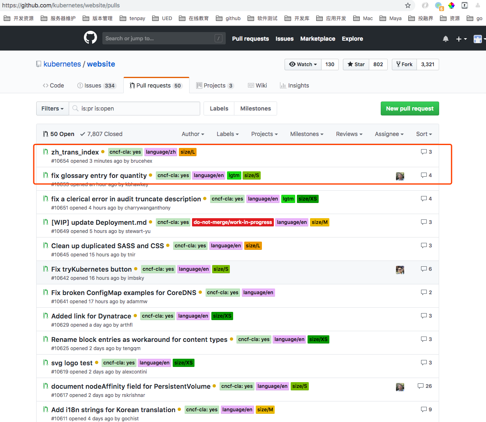

### Step1. 准备工作

注册翻译账户

- `Github` 账户
- `CNCF/CLA` 会员

### Step2. 领取任务翻译

- 领取翻译任务
- Fork 代码库
- 克隆代码翻译

#### 领取翻译任务
打开[翻译任务](https://docs.google.com/spreadsheets/d/1k49XTmtEkhjeh9M118fwwcXVfHvCe-DCy6sVVRQAxBk/edit#gid=1294143213)，我们先认领一篇翻译任务：
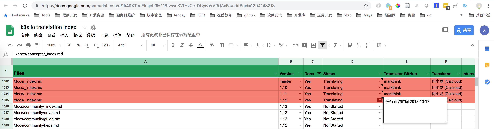

#### Fork 翻译库并切换分支翻译

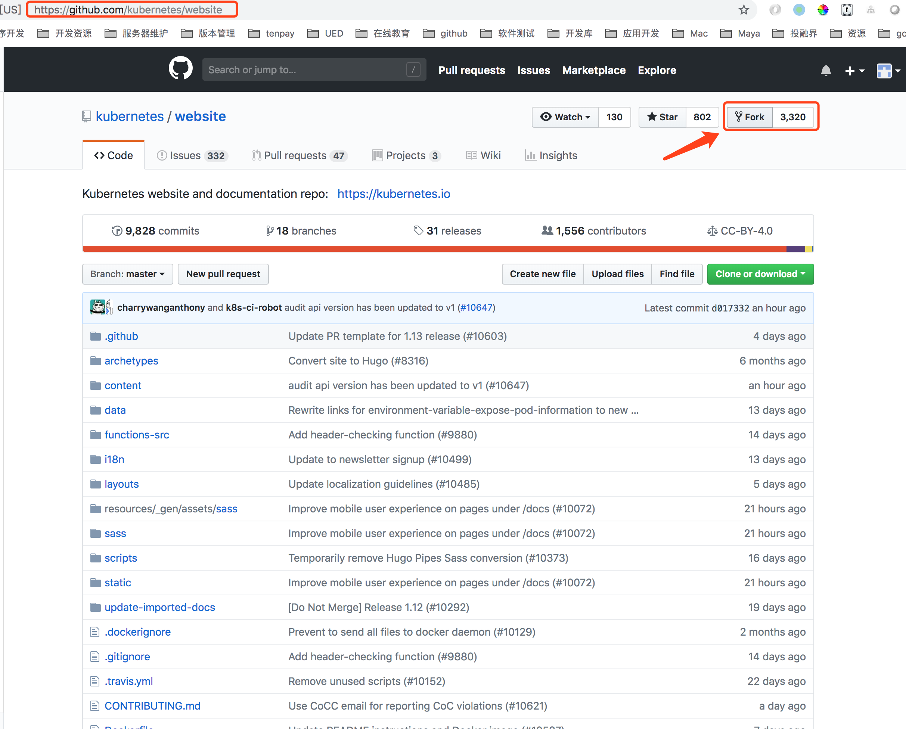

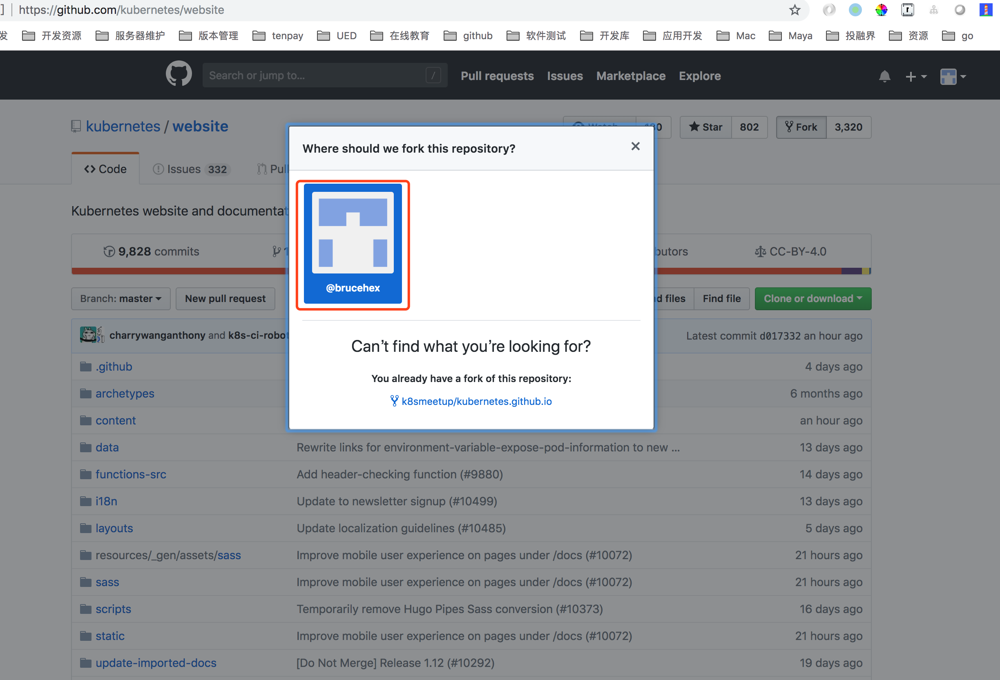

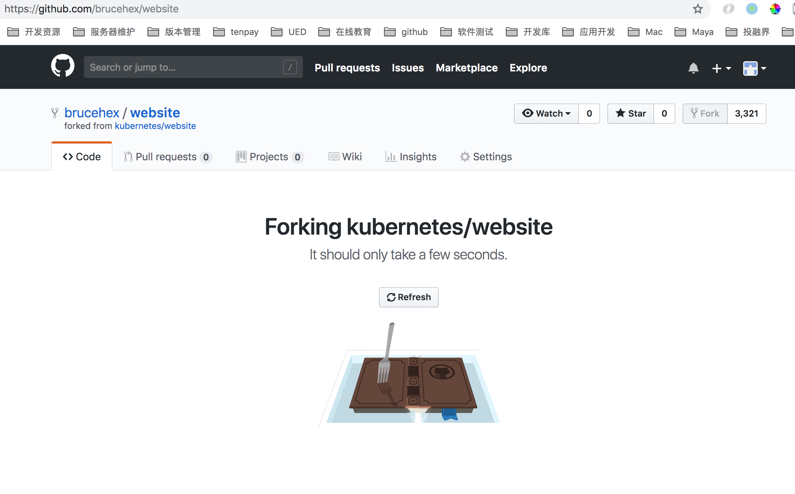

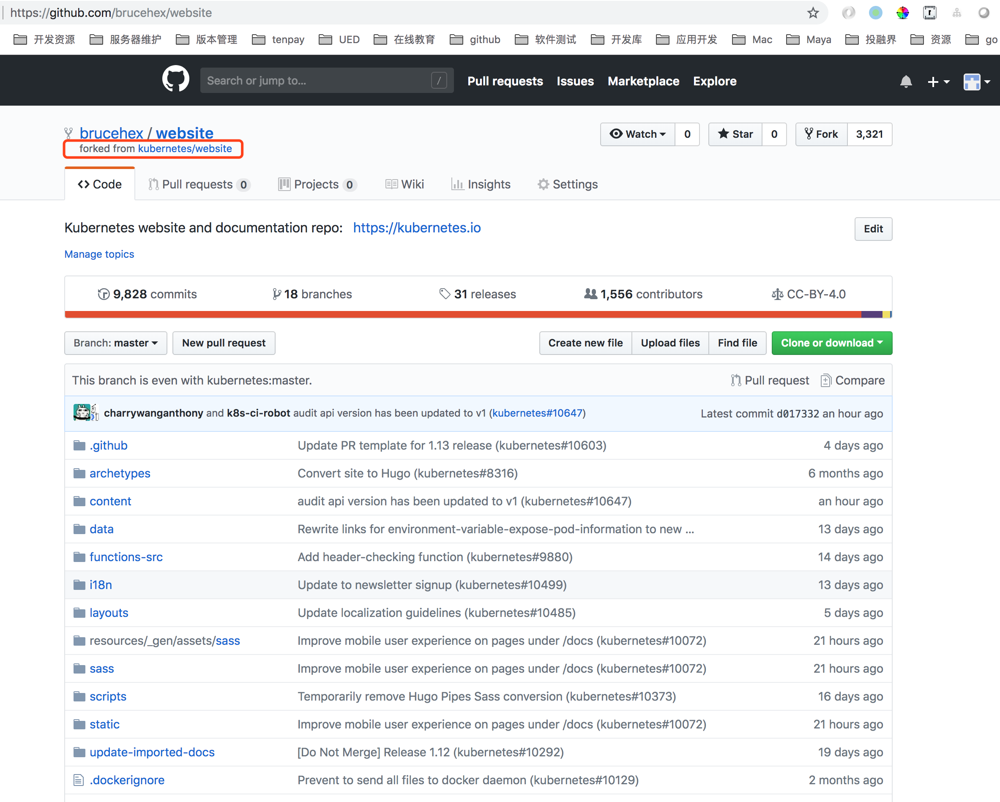

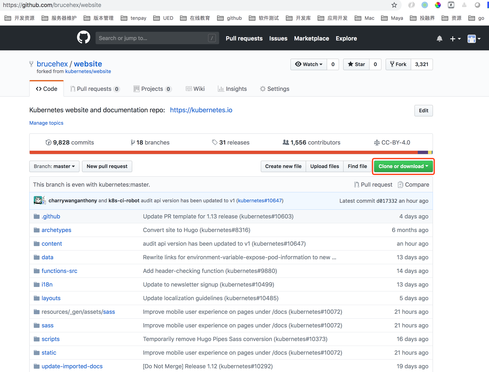

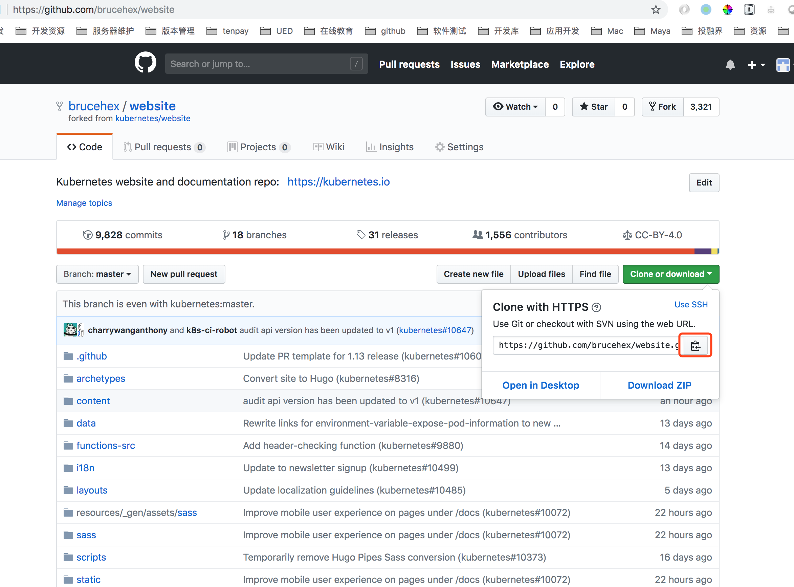


#### 克隆代码翻译

准备本地翻译目录 `brucehex`,进入并 `clone` 代码

```bash
➜  brucehex git clone https://github.com/brucehex/website.git
Cloning into 'website'...
remote: Enumerating objects: 25, done.
remote: Counting objects: 100% (25/25), done.
remote: Compressing objects: 100% (17/17), done.
remote: Total 87507 (delta 8), reused 16 (delta 7), pack-reused 87482
Receiving objects: 100% (87507/87507), 129.35 MiB | 2.64 MiB/s, done.
Resolving deltas: 100% (56085/56085), done.
```

查看远程分支

```bash
# 查看远程分支
git branch -a
```
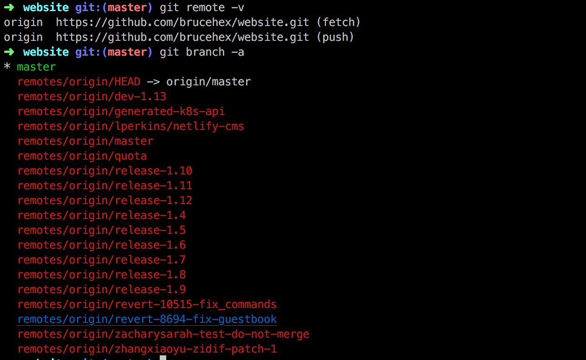

- 翻译 `master` 分支
- 翻译 `release-1.12` 分支
- 翻译 `release-1.11` 分支
- 翻译 `release-1.10` 分支

##### 翻译 `master` 分支

```bash
➜  website git checkout master
➜  website git:(master) git status
On branch master
Your branch is up-to-date with 'origin/master'.
Changes not staged for commit:
  (use "git add <file>..." to update what will be committed)
  (use "git checkout -- <file>..." to discard changes in working directory)

	modified:   content/zh/_index.html

no changes added to commit (use "git add" and/or "git commit -a")
➜  website git:(master) ✗ git add .
➜  website git:(master) ✗ git commit -m 'zh_trans_index'
[master 076468b9a] zh_trans_index
 1 file changed, 91 insertions(+), 153 deletions(-)
 rewrite content/zh/_index.html (96%)
➜  website git push
warning: push.default is unset; its implicit value is changing in
Git 2.0 from 'matching' to 'simple'. To squelch this message
and maintain the current behavior after the default changes, use:

  git config --global push.default matching

To squelch this message and adopt the new behavior now, use:

  git config --global push.default simple

See 'git help config' and search for 'push.default' for further information.
(the 'simple' mode was introduced in Git 1.7.11. Use the similar mode
'current' instead of 'simple' if you sometimes use older versions of Git)

Username for 'https://github.com': brucehex
Password for 'https://brucehex@github.com':
Counting objects: 9, done.
Delta compression using up to 2 threads.
Compressing objects: 100% (5/5), done.
Writing objects: 100% (5/5), 2.51 KiB | 0 bytes/s, done.
Total 5 (delta 3), reused 0 (delta 0)
remote: Resolving deltas: 100% (3/3), completed with 3 local objects.
To https://github.com/brucehex/website.git
   d017332..076468b  master -> master
```

##### 翻译 `release-1.12` 分支

```bash
git checkout release-1.12
```

##### 翻译 `release-1.11` 分支

```bash
git checkout release-1.11
```

##### 翻译 `release-1.10` 分支


```bash
git checkout release-1.10
```


### Step3. 向上游指定分支提交 `PR`

- 向 Master 分支推送翻译PR
- 向 release-1.12 分支推送翻译PR
- 向 release-1.11 分支推送翻译PR
- 向 release-1.10 分支推送翻译PR

#### 向 Master 分支推送翻译PR

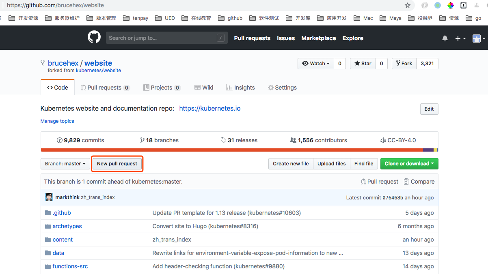

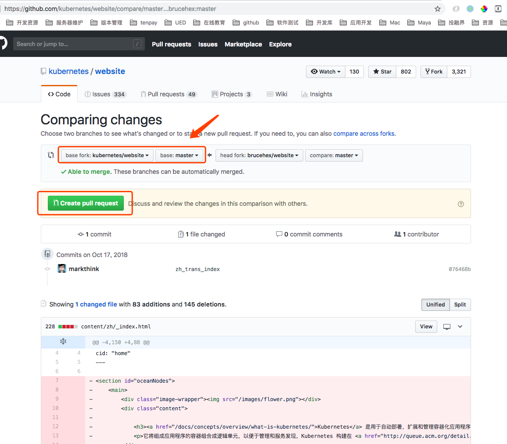

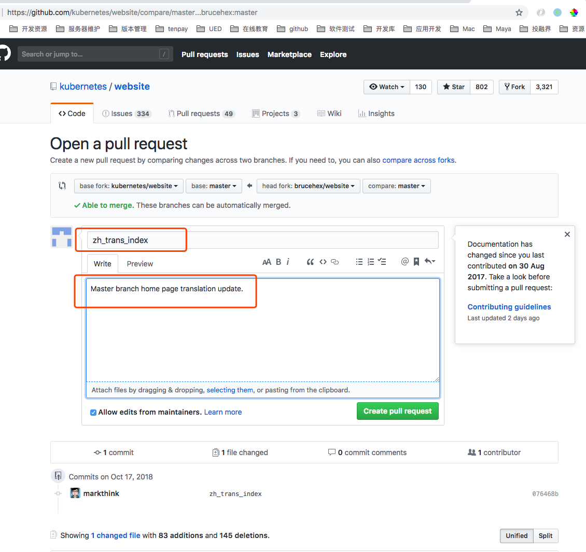

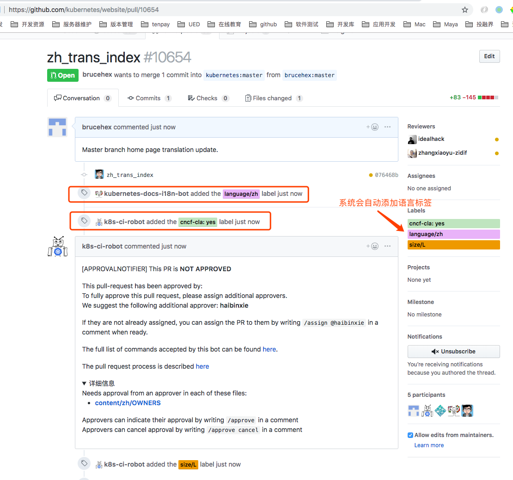
