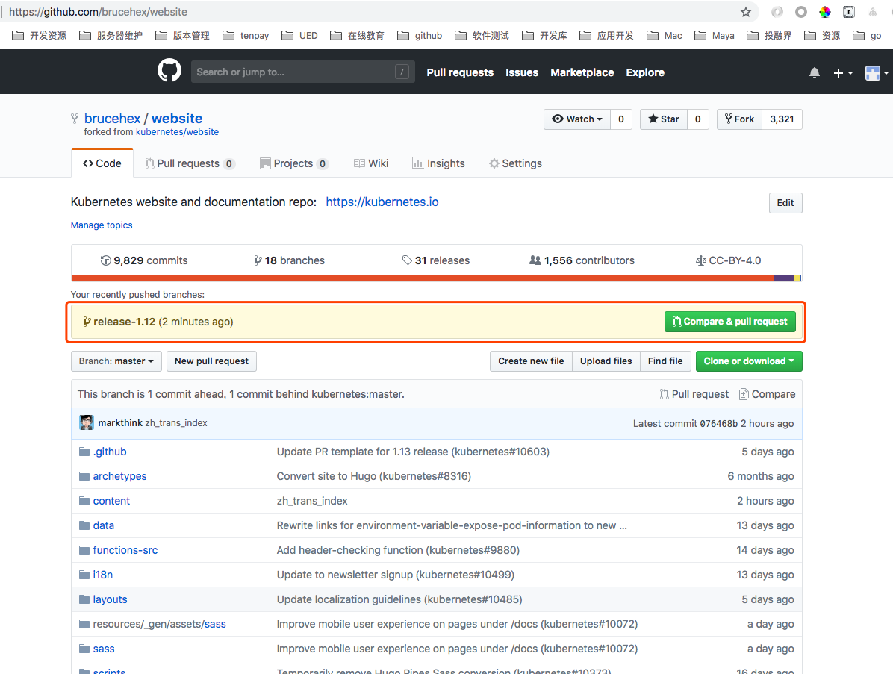
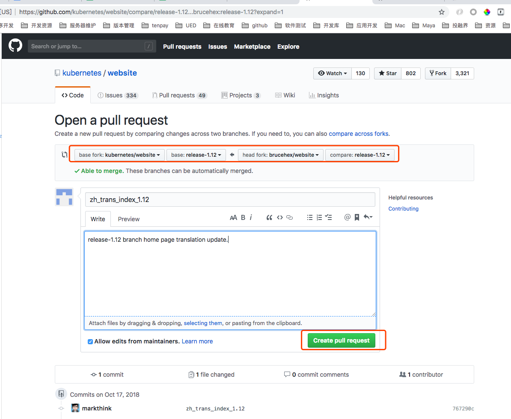
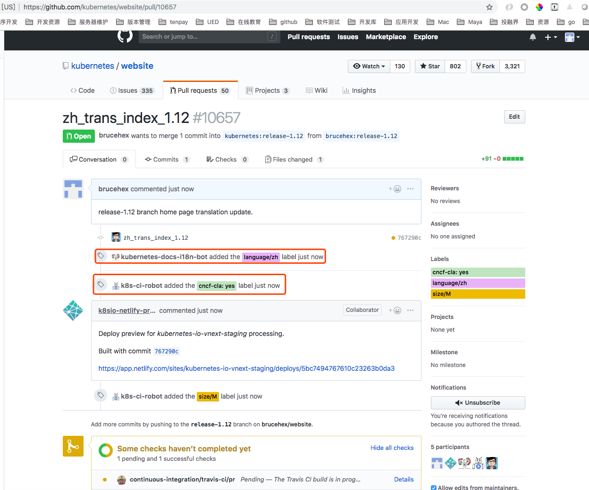
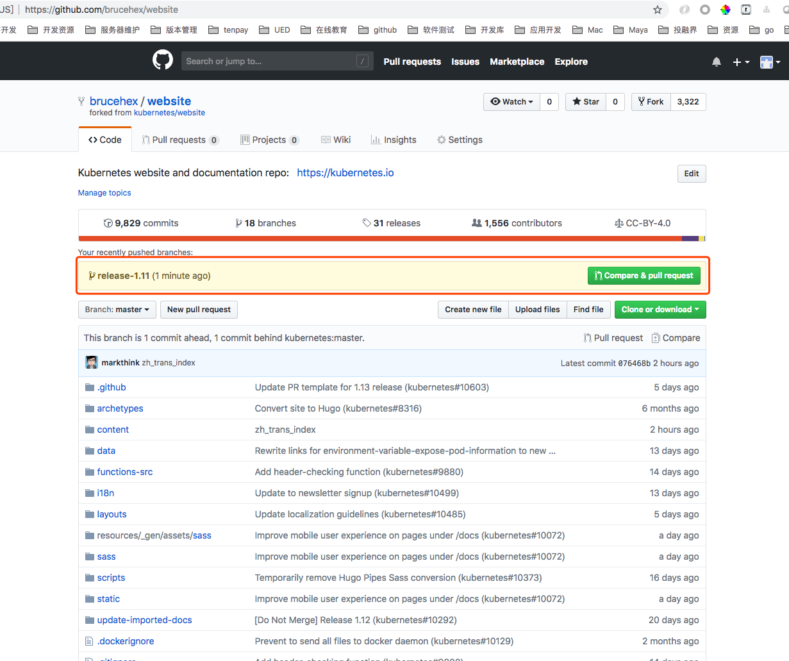
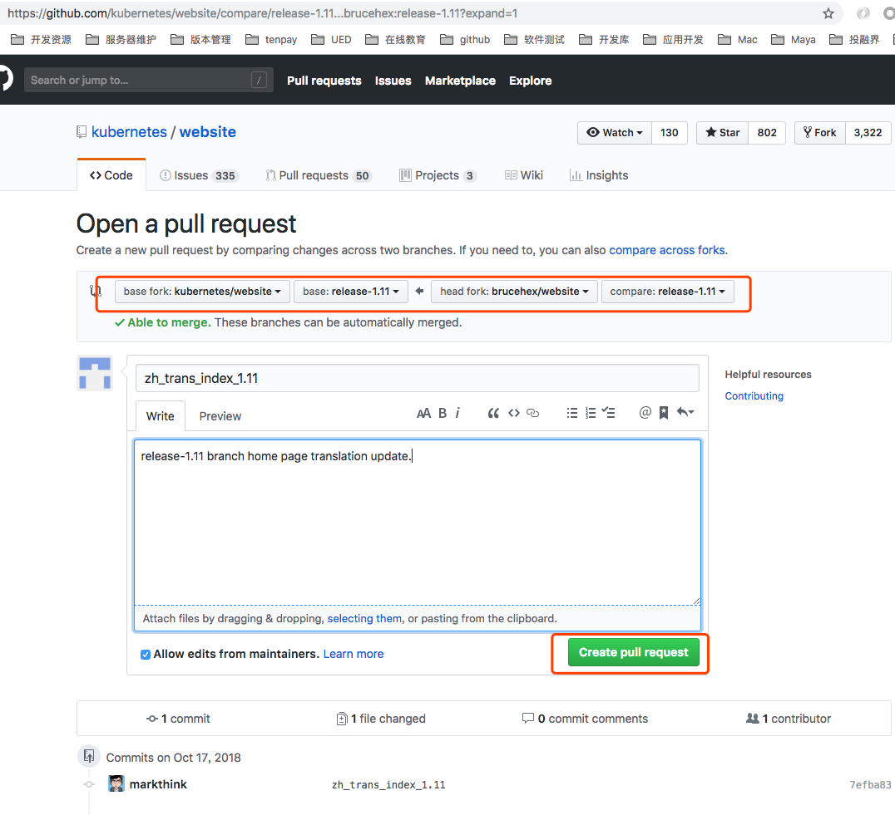
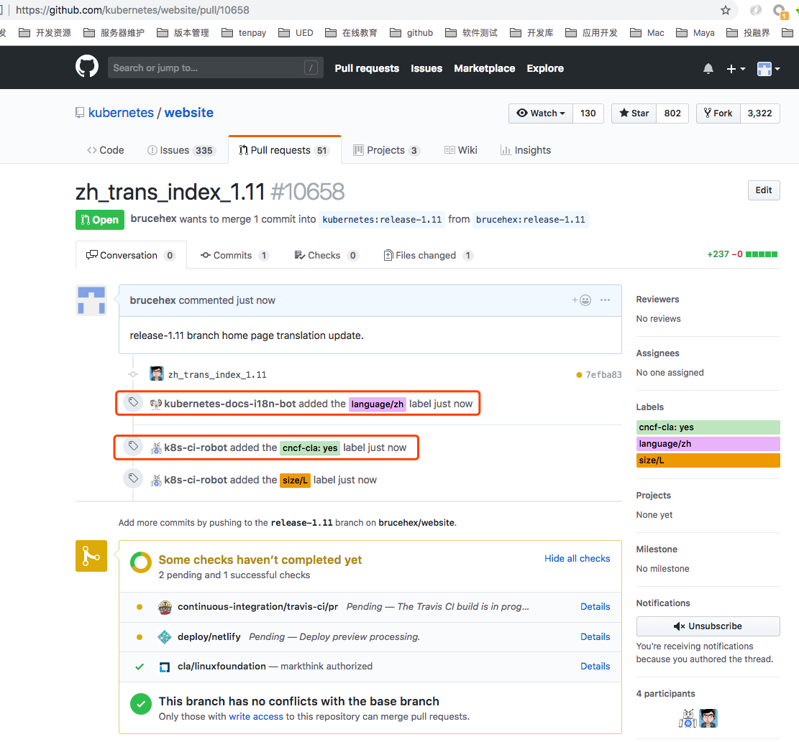
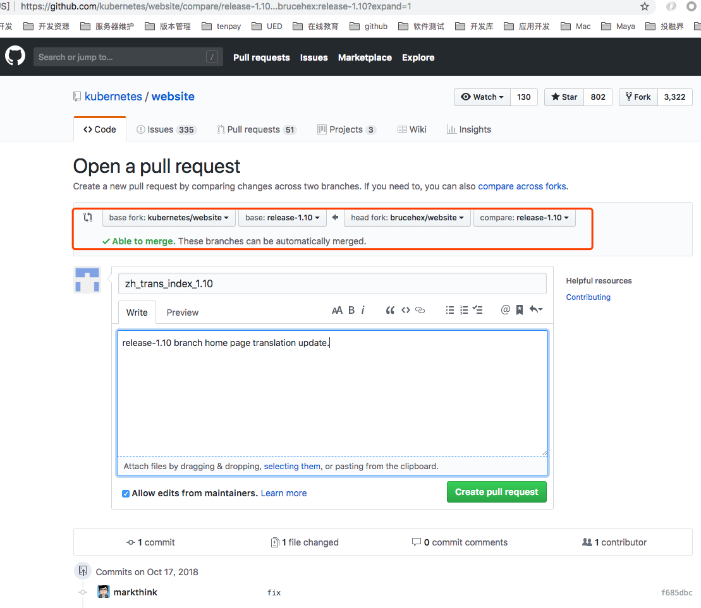
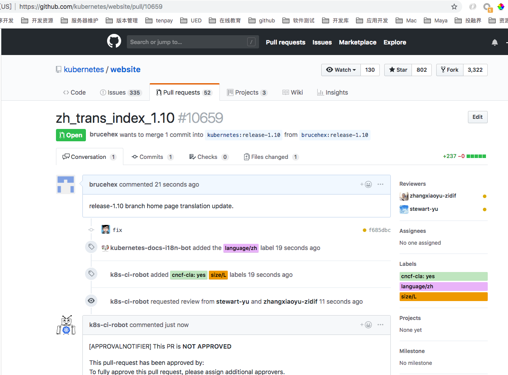
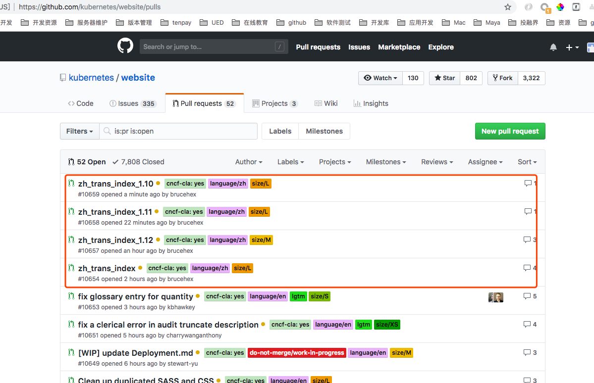

# 适用于零基础的新人指引教程

本篇主要包含如下内容：

- 注册 `Github` 账户
- 注册 CNCF/CLA 会员
- 领取翻译任务
- Fork 翻译库并切换分支翻译
- 向上游指定分支提交 PR

Kubernetes 文档现在可以自动区分各语种`PR`了，如下图：


### Step1. 准备工作

注册翻译账户

- `Github` 账户
- `CNCF/CLA` 会员

### Step2. 领取任务

- 领取翻译任务
- Fork 代码库
- 克隆代码翻译

#### 领取任务
打开[翻译任务](https://docs.google.com/spreadsheets/d/1k49XTmtEkhjeh9M118fwwcXVfHvCe-DCy6sVVRQAxBk/edit#gid=1294143213)，我们先认领一篇翻译任务：


#### Fork 翻译库切换分支翻译


#### 克隆代码翻译

准备本地翻译目录 `brucehex`,进入并 `clone` 代码

```bash
➜  brucehex git clone https://github.com/brucehex/website.git
Cloning into 'website'...
remote: Enumerating objects: 25, done.
remote: Counting objects: 100% (25/25), done.
remote: Compressing objects: 100% (17/17), done.
remote: Total 87507 (delta 8), reused 16 (delta 7), pack-reused 87482
Receiving objects: 100% (87507/87507), 129.35 MiB | 2.64 MiB/s, done.
Resolving deltas: 100% (56085/56085), done.
```

查看远程分支

```bash
# 查看远程分支
git branch -a
```


- 翻译 `master` 分支
- 翻译 `release-1.12` 分支
- 翻译 `release-1.11` 分支
- 翻译 `release-1.10` 分支

##### 翻译 `master` 分支

```bash
➜  website git checkout master
➜  website git:(master) git status
On branch master
Your branch is up-to-date with 'origin/master'.
Changes not staged for commit:
  (use "git add <file>..." to update what will be committed)
  (use "git checkout -- <file>..." to discard changes in working directory)

	modified:   content/zh/_index.html

no changes added to commit (use "git add" and/or "git commit -a")
➜  website git:(master) ✗ git add .
➜  website git:(master) ✗ git commit -m 'zh_trans_index'
[master 076468b9a] zh_trans_index
 1 file changed, 91 insertions(+), 153 deletions(-)
 rewrite content/zh/_index.html (96%)
➜  website git push
warning: push.default is unset; its implicit value is changing in
Git 2.0 from 'matching' to 'simple'. To squelch this message
and maintain the current behavior after the default changes, use:

  git config --global push.default matching

To squelch this message and adopt the new behavior now, use:

  git config --global push.default simple

See 'git help config' and search for 'push.default' for further information.
(the 'simple' mode was introduced in Git 1.7.11. Use the similar mode
'current' instead of 'simple' if you sometimes use older versions of Git)

Username for 'https://github.com': brucehex
Password for 'https://brucehex@github.com':
Counting objects: 9, done.
Delta compression using up to 2 threads.
Compressing objects: 100% (5/5), done.
Writing objects: 100% (5/5), 2.51 KiB | 0 bytes/s, done.
Total 5 (delta 3), reused 0 (delta 0)
remote: Resolving deltas: 100% (3/3), completed with 3 local objects.
To https://github.com/brucehex/website.git
   d017332..076468b  master -> master
```

##### 翻译 `release-1.12` 分支

```bash
➜  brucehex cd website
➜  website git:(master) git checkout release-1.12
Branch release-1.12 set up to track remote branch release-1.12 from origin.
Switched to a new branch 'release-1.12'
➜  website git:(release-1.12) vscode .
➜  website git:(release-1.12) git status
On branch release-1.12
Your branch is up-to-date with 'origin/release-1.12'.
Untracked files:
  (use "git add <file>..." to include in what will be committed)

	content/zh/

nothing added to commit but untracked files present (use "git add" to track)
➜  website git:(release-1.12) ✗ git add .
➜  website git:(release-1.12) ✗ git commit -m 'zh_trans_index_1.12'
[release-1.12 767290cfe] zh_trans_index_1.12
 1 file changed, 91 insertions(+)
 create mode 100644 content/zh/_index.html

➜  website git:(release-1.12) ✗ git status
# On branch release-1.12
# Your branch is ahead of 'origin/release-1.12' by 1 commit.
#   (use "git push" to publish your local commits)
#
nothing to commit, working directory clean
[root@251c1fca23f9 files]# git push
warning: push.default is unset; its implicit value is changing in
Git 2.0 from 'matching' to 'simple'. To squelch this message
and maintain the current behavior after the default changes, use:

  git config --global push.default matching

To squelch this message and adopt the new behavior now, use:

  git config --global push.default simple

See 'git help config' and search for 'push.default' for further information.
(the 'simple' mode was introduced in Git 1.7.11. Use the similar mode
'current' instead of 'simple' if you sometimes use older versions of Git)

Username for 'https://github.com': brucehex
Password for 'https://brucehex@github.com':
Counting objects: 7, done.
Delta compression using up to 2 threads.
Compressing objects: 100% (4/4), done.
Writing objects: 100% (5/5), 2.50 KiB | 0 bytes/s, done.
Total 5 (delta 2), reused 0 (delta 0)
remote: Resolving deltas: 100% (2/2), completed with 2 local objects.
To https://github.com/brucehex/website.git
   01677e2..767290c  release-1.12 -> release-1.12
```

##### 翻译 `release-1.11` 分支

```bash
➜  website git:(release-1.12) git checkout release-1.11
Branch release-1.11 set up to track remote branch release-1.11 from origin.
Switched to a new branch 'release-1.11'
➜  website git:(release-1.11) vscode .
➜  website git:(release-1.11) git status
On branch release-1.11
Your branch is up-to-date with 'origin/release-1.11'.
Untracked files:
  (use "git add <file>..." to include in what will be committed)

	content/zh/

nothing added to commit but untracked files present (use "git add" to track)
➜  website git:(release-1.11) ✗ git add .
➜  website git:(release-1.11) ✗ git commit -m 'zh_trans_index_1.11'
[release-1.11 7efba831a] zh_trans_index_1.11
 1 file changed, 237 insertions(+)
 create mode 100644 content/zh/_index.html
➜  website git:(release-1.11) ✗ git push
warning: push.default is unset; its implicit value is changing in
Git 2.0 from 'matching' to 'simple'. To squelch this message
and maintain the current behavior after the default changes, use:

  git config --global push.default matching

To squelch this message and adopt the new behavior now, use:

  git config --global push.default simple

See 'git help config' and search for 'push.default' for further information.
(the 'simple' mode was introduced in Git 1.7.11. Use the similar mode
'current' instead of 'simple' if you sometimes use older versions of Git)

Username for 'https://github.com': brucehex
Password for 'https://brucehex@github.com':
Counting objects: 7, done.
Delta compression using up to 2 threads.
Compressing objects: 100% (4/4), done.
Writing objects: 100% (5/5), 5.27 KiB | 0 bytes/s, done.
Total 5 (delta 2), reused 0 (delta 0)
remote: Resolving deltas: 100% (2/2), completed with 2 local objects.
To https://github.com/brucehex/website.git
   712f231..7efba83  release-1.11 -> release-1.11
```

##### 翻译 `release-1.10` 分支


```bash
➜  website git:(release-1.11) git checkout release-1.10
Branch release-1.10 set up to track remote branch release-1.10 from origin.
Switched to a new branch 'release-1.10'
➜  website git:(release-1.10) vscode .
➜  website git:(release-1.10) git add .
➜  website git:(release-1.10) ✗ git status
On branch release-1.10
Your branch is up-to-date with 'origin/release-1.10'.
Changes to be committed:
  (use "git reset HEAD <file>..." to unstage)

	new file:   content/zh/_index.html

➜  website git:(release-1.10) ✗ git commit -m 'fix'
[release-1.10 f685dbc31] fix
 1 file changed, 237 insertions(+)
 create mode 100644 content/zh/_index.html

➜  website git:(release-1.10) ✗  git push
warning: push.default is unset; its implicit value is changing in
Git 2.0 from 'matching' to 'simple'. To squelch this message
and maintain the current behavior after the default changes, use:

  git config --global push.default matching

To squelch this message and adopt the new behavior now, use:

  git config --global push.default simple

See 'git help config' and search for 'push.default' for further information.
(the 'simple' mode was introduced in Git 1.7.11. Use the similar mode
'current' instead of 'simple' if you sometimes use older versions of Git)

Username for 'https://github.com': brucehex
Password for 'https://brucehex@github.com':
Counting objects: 7, done.
Delta compression using up to 2 threads.
Compressing objects: 100% (4/4), done.
Writing objects: 100% (5/5), 5.25 KiB | 0 bytes/s, done.
Total 5 (delta 2), reused 0 (delta 0)
remote: Resolving deltas: 100% (2/2), completed with 2 local objects.
To https://github.com/brucehex/website.git
   888d51e..f685dbc  release-1.10 -> release-1.10
```


### Step3. 向上游指定分支提交 `PR`

- 向 Master 分支推送翻译PR
- 向 release-1.12 分支推送翻译PR
- 向 release-1.11 分支推送翻译PR
- 向 release-1.10 分支推送翻译PR

#### 向 Master 分支推送翻译PR


#### 向 release-1.12 分支推送翻译PR







#### 向 release-1.11 分支推送翻译PR







#### 向 release-1.10 分支推送翻译PR







### 总结

同一篇文章推送到四个不同的版本分支里面，需要提交四个PR，如下图所示：



