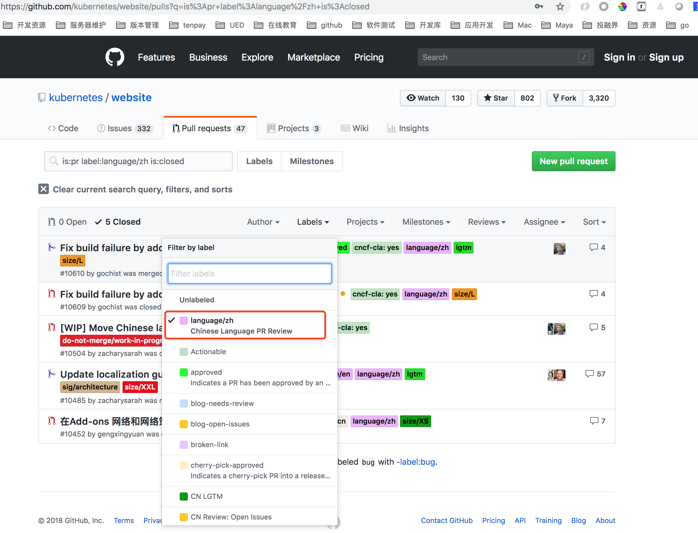

# 翻译任务表解读

任务地址：[翻译任务](https://docs.google.com/spreadsheets/d/1k49XTmtEkhjeh9M118fwwcXVfHvCe-DCy6sVVRQAxBk/edit#gid=1294143213)

## 关健颜色状态与字段说明

- **Files**
  - 翻译文档全路径名 如 /docs/user-journeys/users/cluster-operator/intermediate.md
- **Version**
  - v1.10
  - v1.11
  - v1.12
  - master
- **Docs**
  - Yes Kubernetes 主文档
  - No Kubernetes 辅助文档 如 Blog+Case 相关文档
- **Status** - 参考颜色代码： http://tool.oschina.net/commons?type=3
  - Not Started  - 未翻译(默认白色背景) 可领取任务
  - Translating  - 领取任务状态(默认 Salmon 背景) -  250 128 114	#FA8072
  - **Translating Update** - Master 分支已译过(需要按版本更新) -  205 0 0	#CD0000
  - Pull Request Sent - 已往 Website 提交翻译PR(默认 LightGoldenrod1 背景) - 255 236 139	#FFEC8B
  - Under Internal Review - Review 状态(默认 DeepSkyBlue 背景) - 0 191 255	#00BFFF
  - Pull Request Merged - 已合并 Website 代码库(默认 LightGreen 背景) - 144 238 144	#90EE90
  - Upstream Request Merged - 已合并到上游 (默认 LimeGreen 背景) - 50 205 50	#32CD32
- **Translator GitHub**
  - 译者 GITHUB 登陆名 如：xiaosuiba
- **Translator**
  - 译者中文名 如：李晶晶
- **Internal Reviewer**
  - cncf/cla 会员
  - 译者
- **Internal Review Status** - 内部 review 状态，一般用于自纠自查
  - Not start 未检查
  - Reviewing 检查中
  - Done 已完成校验
- **PR Reviewer(CNCF member)**
  - cncf/cla 会员
- **Upstream Pull Request link**
  - [PR 的网址链接更新](https://github.com/kubernetes/website/issues?utf8=%E2%9C%93&q=is%3Aclose+label%3Alanguage%2Fzh)
- **Priority** - 目前共有五个级别 P0/P1/P2/P3/P4/P5，主版本文档优先级最高..
  - P0 v1.12/master 主文档
  - P1 v1.11 主文档
  - P2 v1.10 主文档
  - P3 v1.12/master 辅助文档 如 Blog+Case 相关文档
  - P4 v1.11 辅助文档 如 Blog+Case 相关文档
  - P5 v1.10 辅助文档 如 Blog+Case 相关文档
- **note** - 隐藏列-记录翻译任务领取时间(领取任务自动设置)
  - 15 天状态不更新，重置翻译状态为未翻译，方便他人领取任务，避免文章长时间无效占用

 **注：由于目前只有一个上游翻译仓库，故以后 `Pull Request Merged` 与 `Upstream Request Merged` 已无任何区别**
 
 目前 `Pull Request Merged` 状态的文件表示原先已经翻译过，在旧的翻译仓库，可以从[这里](https://github.com/kubernetes-retired/kubernetes-docs-zh)去查看。
 
#### 特别提醒:

`Translating Update` 此状态文档在 Master 分支已译过，仍保留原译者，还是希望此文由原译者完成。

目前支持多版本翻译，译者需要单独对每个分支进行提交 PR..

所有中文的PR，默认系统会打上语言标签 `label:language/zh` 如下图所示：

